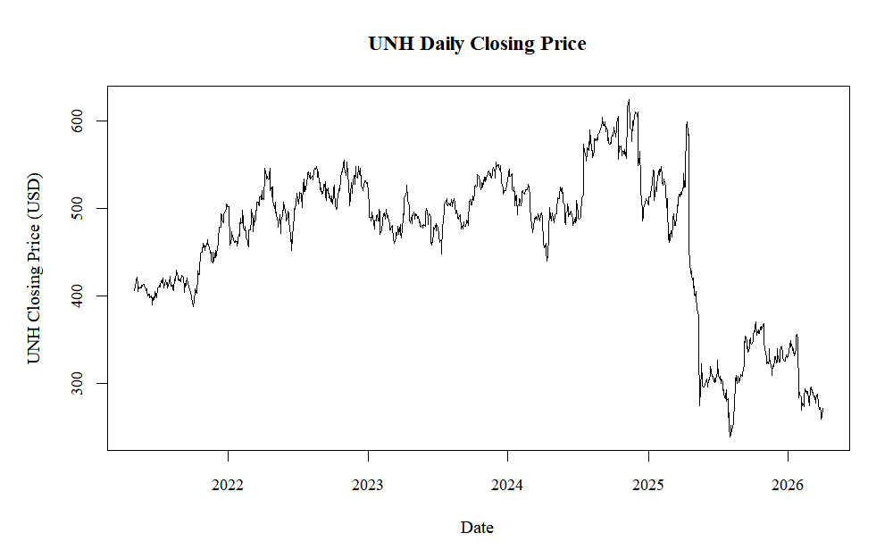
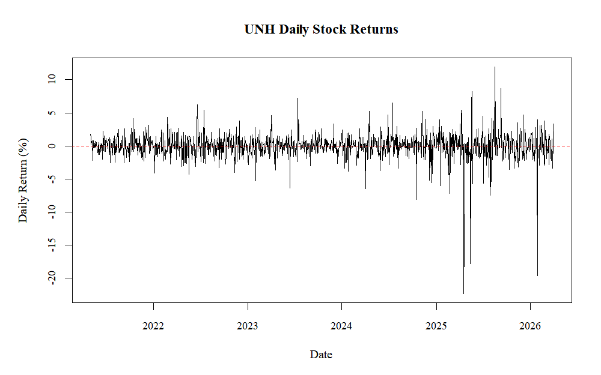
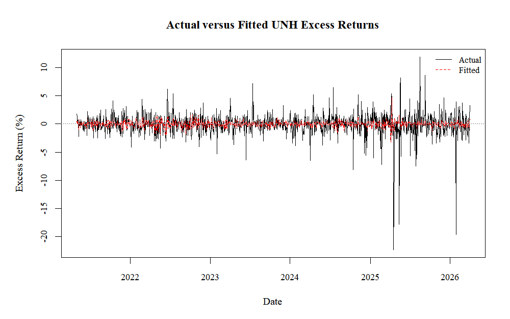
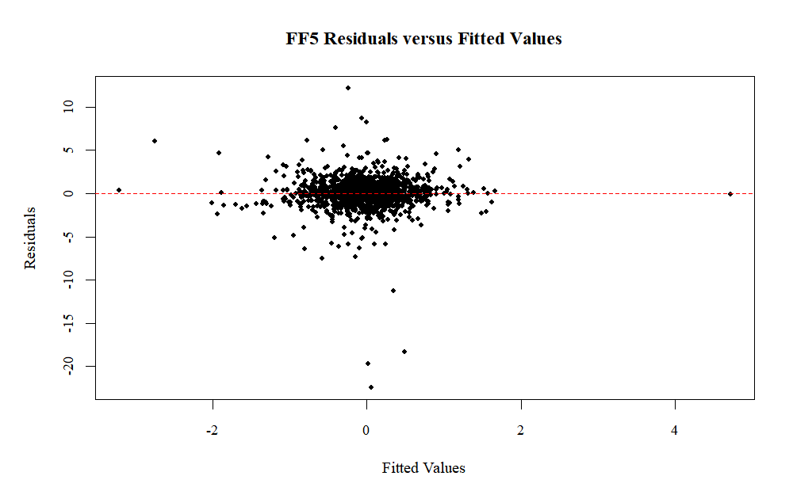
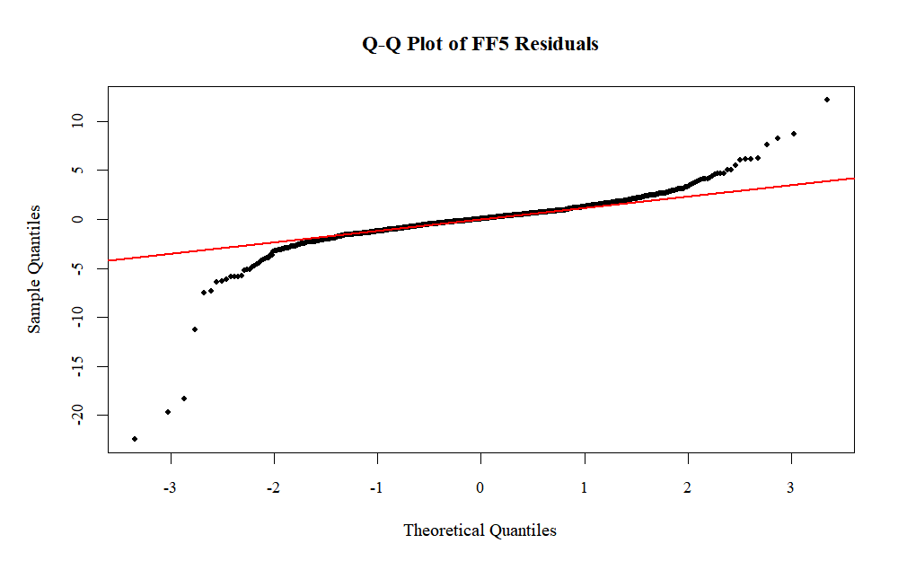

# An Econometric Analysis of UnitedHealth Group's Stock Returns Using the Fama-French Five-Factor Model

Junior Hernandez Paulino

Course: ECO 402 Econometrics, Lehman College, Spring 2026

Professor: Dr. Nikolaos Papanikolaou

Date: May 17, 2026

## Executive Summary

Market exposure explains only a small part of UNH's daily excess stock returns. Using Bloomberg historical prices and daily Fama-French factors, this study estimates CAPM, FF3, and FF5 by ordinary least squares for 2021-05-03 to 2026-03-31, with 1,234 observations. The market coefficient is positive, statistically significant, and below one in each model. Alpha is not statistically significant after factor controls. FF5 has an R-squared of about 0.066. The Breusch-Pagan and White tests fail to reject homoskedasticity, while residuals are non-normal and fat-tailed. The models identify market sensitivity but leave most daily return variation unexplained. Firm-specific information may account for some of that variation, although the regressions do not identify the causes of individual shocks.

## Abstract

Daily Bloomberg PX_LAST prices and Kenneth French five-factor data are used to estimate market and non-market exposures in UnitedHealth Group's stock returns. The merged sample covers 2021-05-03 to 2026-03-31 and includes 1,234 observations. Returns and factors are measured in percent, and the dependent variable is UNH_Excess_Return. CAPM, the Fama-French three-factor model, and the Fama-French five-factor model are estimated by OLS on the same sample. The market coefficient is positive and significant at the 1 percent level in every specification, with estimates ranging from about 0.41 to 0.51. Alpha is approximately -0.04 and is not statistically significant. FF5 has an R-squared of 0.0659, so the included factors explain little of the variation in daily excess returns. The Breusch-Pagan and White tests fail to reject homoskedasticity, whereas Anderson-Darling rejects residual normality. HC1 standard errors leave market significance unchanged but weaken the evidence for CMA. The results support below-market sensitivity during the sample, not low total volatility or a complete explanation of UNH's daily movements.

## 1. Introduction

Do the Fama-French risk factors explain UnitedHealth Group's daily excess stock returns? Factor regressions measure how returns vary with broad market and other systematic factors. For a single stock, low market sensitivity can coexist with large daily movements that these factors do not explain.

UNH's managed-care business and the sharp stock-price decline during the sample make it a useful case for this comparison. Bloomberg's May 2026 DES screen classifies UNH as Managed Care and reports a beta versus the S&P 500 Index of 0.61. That later snapshot is background information, not a regression input. The analysis asks whether the daily returns also show a market coefficient below one.

Daily returns are calculated from Bloomberg PX_LAST prices and matched by date to the Fama-French factors. Subtracting the daily risk-free rate gives the dependent variable, UNH excess return. CAPM provides the market-only specification; FF3 and FF5 add size, value, profitability, and investment factors. Estimation and diagnostic testing follow the course OLS framework and the supplied R econometrics text.

The market factor is significant in all three models, with an estimated coefficient below one. Alpha is insignificant throughout. The non-market factors are jointly significant, but the gain in fit is small. Statistical significance therefore needs to be distinguished from how much daily return variation the models explain.

## 2. Company Background and Model Framework

UnitedHealth Group Incorporated's Form 10-Q lists UNH common stock on the New York Stock Exchange. Bloomberg's May 2026 DES screen classifies the company as Managed Care, lists its headquarters in Eden Prairie, Minnesota, and reports about 390,000 employees. It reports market capitalization of about $364.0 billion and about 908.1 million shares outstanding. The displayed 52-week high was $404.15 on 05/13/26, and the low was $234.60 on 08/01/25. These figures describe the later company snapshot and are not regression inputs.

The DES screen reports a 12-month total return of 33.84 percent, beta versus SPX of 0.61, indicated gross dividend yield of 2.21 percent, and five-year net dividend growth of 12.07 percent. Trailing 12-month EPS was 15.50, compared with estimated EPS of 18.36. The DVD screen reports the same yield and dividend-growth figures. The dividend history documents distributions to shareholders; it does not establish low stock-return volatility.

Bloomberg's 2025 revenue breakdown allocates about $312.730 billion to UnitedHealthcare and $130.917 billion to Optum out of $447.567 billion in consolidated revenue, with a separate adjustment category. These allocations are roughly 70 percent and 29 percent of the total. They are allocations of consolidated revenue, not gross segment revenues before eliminations. The two businesses give UNH exposure to different parts of health care.

The Bloomberg financial statement files show that revenue rose from $400.278 billion in 2024 to $447.567 billion in 2025, while profitability weakened. In the adjusted income-statement view, 2025 EBITDA was about $27.474 billion, adjusted net income was about $14.142 billion, adjusted EPS was about $15.52, cash from operations was about $19.697 billion, and free cash flow was about $16.075 billion. Current or LTM cash from operations was about $23.153 billion, and current or LTM free cash flow was about $19.666 billion. At year-end 2025, cash, cash equivalents, and short-term investments totaled about $28.121 billion and total debt was about $83.004 billion. The profitability file reports ROE of 12.91 percent, ROA of 3.97 percent, EBITDA margin of 5.57 percent, net income margin of 2.69 percent, and a dividend payout ratio of 65.75 in 2025. Cash and cash equivalents alone were $24.365 billion. The adjusted income-statement view and the ratio screen use different measures: the reported 5.57 percent EBITDA margin is from the ratio screen and is not the margin implied by the adjusted income-statement EBITDA figure.

The Form 10-Q covering the quarter ended March 31, 2026 provides retrospective context for the sample endpoint. Q1 2026 revenues were $111.721 billion versus $109.575 billion in Q1 2025. Earnings from operations were $8.990 billion versus $9.119 billion, and net earnings attributable to common shareholders were $6.280 billion versus $6.292 billion. Cash from operating activities was $8.912 billion versus $5.456 billion, cash and cash equivalents were $28.001 billion, long-term debt was $71.440 billion, common dividends paid were $2.005 billion or $2.21 per share, and shares outstanding as of April 30, 2026 were 908,144,404. Management discussion states that revenue growth was driven by pricing trends at UnitedHealthcare and growth at Optum Rx, partly offset by fewer people served in Medicare Advantage, commercial risk-based offerings, and Medicaid, along with fewer patients served under value-based arrangements at Optum Health. The filing also reports UnitedHealthcare operating earnings up 9 percent and Optum operating earnings down 15 percent. The filing was available after the sample endpoint and is not treated as an explanatory variable observed throughout the sample.

CAPM relates UNH excess return to market excess return: UNH_Excess_Return_t = alpha + beta_1 Mkt_RF_t + u_t. FF5 adds four factors: UNH_Excess_Return_t = alpha + beta_1 Mkt_RF_t + beta_2 SMB_t + beta_3 HML_t + beta_4 RMW_t + beta_5 CMA_t + u_t. UNH_Excess_Return is the UNH daily return minus RF. Mkt_RF is market excess return, SMB is Small Minus Big, HML is High Minus Low, RMW is Robust Minus Weak, and CMA is Conservative Minus Aggressive. RF is the risk-free rate, and u_t is the error term.

## 3. Data and Descriptive Statistics

The analysis uses daily Bloomberg PX_LAST prices and the Kenneth French daily five-factor file. RF comes from that same factor file, not a Bloomberg Treasury screen. The first price observation cannot yield a return because it has no preceding trading-day price in the file.

The stock return is computed as UNH_Return_t = ((PX_LAST_t / PX_LAST_(t-1)) - 1) * 100. The excess return is computed as UNH_Excess_Return_t = UNH_Return_t - RF_t. Returns and factors are kept in percent, so the regression coefficients have a percentage-point interpretation. The final sample uses only overlapping dates after merging the UNH return file and the Fama-French factor file by date. The merged sample runs from 2021-05-03 to 2026-03-31 and contains 1,234 observations. This is a price-derived return measure; the baseline does not separately add cash dividends or implement dividend reinvestment.

No valid observations were removed, trimmed, or winsorized. Large returns remain in the sample. Residual diagnostics examine their presence, and HC1 standard errors assess sensitivity of inference without changing the OLS coefficients.

Table 1. Descriptive Statistics

| Variable | Obs. | Mean | Median | Std. Dev. | Min. | Max. |
| --- | --- | --- | --- | --- | --- | --- |
| UNH_Excess_Return | 1,234 | -0.024925136 | 0.03529529 | 1.980748818 | -22.39967 | 11.95834 |
| Mkt_RF | 1,234 | 0.030340357 | 0.04000000 | 1.115246348 | -5.92000 | 9.65000 |
| SMB | 1,234 | -0.019781199 | -0.04000000 | 0.694038828 | -2.53000 | 4.20000 |
| HML | 1,234 | 0.024489465 | -0.00500000 | 0.907521928 | -3.89000 | 3.64000 |
| RMW | 1,234 | 0.017228525 | 0.00000000 | 0.659952271 | -2.23000 | 4.25000 |
| CMA | 1,234 | 0.007074554 | 0.00000000 | 0.589601663 | -2.92000 | 2.37000 |
| RF | 1,234 | 0.013881686 | 0.02000000 | 0.008642992 | 0.00000 | 0.02000 |

UNH's mean excess return is slightly negative and its median positive (Table 1). The standard deviation is 1.980748818 percent, with returns ranging from -22.39967 to 11.95834 percent. Daily volatility is large relative to the mean.

*Figure 1. UNH Daily Closing Price, May 2021 to March 2026.*

Figure 1 plots UNH's daily closing price over the regression sample. Prices remained relatively high through much of 2024 before falling sharply in 2025. The price chart alone does not identify the cause of the decline.

*Figure 2. UNH Daily Stock Returns.*

Most daily returns in Figure 2 lie near zero, but several observations are much larger in either direction. The regression must account for this variation, not just the average return.

## 4. Econometric Model

The paper estimates three OLS specifications. The CAPM model is UNH_Excess_Return_t = alpha + beta_1 Mkt_RF_t + u_t. The FF3 model is UNH_Excess_Return_t = alpha + beta_1 Mkt_RF_t + beta_2 SMB_t + beta_3 HML_t + u_t. The FF5 model is UNH_Excess_Return_t = alpha + beta_1 Mkt_RF_t + beta_2 SMB_t + beta_3 HML_t + beta_4 RMW_t + beta_5 CMA_t + u_t.

Because returns and factors are measured in percent, each coefficient measures the predicted percentage-point change in UNH excess return for a one percentage-point change in the factor, holding other included factors constant. Alpha measures the average excess return not explained by the included factors. If alpha is statistically insignificant, the model does not provide evidence of abnormal excess return after controlling for factor exposures.

The OLS assumptions used in the class framework are that the model is linear in parameters, there is no perfect multicollinearity, the error has zero conditional mean, the error variance is constant for usual OLS standard errors, and normality supports exact small-sample inference. Because the sample has 1,234 observations, large-sample interpretation is also relevant. The paper reports conventional standard errors and then checks robust HC1 standard errors as a sensitivity test. These diagnostics do not establish zero conditional mean. Large-sample inference still requires appropriate moment and dependence conditions; a large observation count alone does not ensure valid inference.

## 5. Empirical Results

Table 2 reports CAPM, FF3, and FF5 side by side. Entries labeled "Not included" indicate that a factor is not included in that model. Standard errors are reported in parentheses, and the significance stars follow the class regression output.

Table 2. Regression Results

| Variable | CAPM | FF3 | FF5 |
| --- | --- | --- | --- |
| Alpha | -0.037 (0.055) | -0.048 (0.055) | -0.048 (0.055) |
| Mkt_RF | 0.406*** (0.049) | 0.488*** (0.055) | 0.512*** (0.056) |
| SMB | Not included | -0.126 (0.084) | -0.078 (0.094) |
| HML | Not included | 0.230*** (0.067) | 0.106 (0.086) |
| RMW | Not included | Not included | 0.077 (0.104) |
| CMA | Not included | Not included | 0.269** (0.120) |
| Observations | 1,234 | 1,234 | 1,234 |
| R-squared | 0.052 | 0.062 | 0.066 |
| Adjusted R-squared | 0.052 | 0.059 | 0.062 |

Note: Standard errors are in parentheses. * p < 0.10, ** p < 0.05, *** p < 0.01.

In the CAPM regression, the Mkt_RF coefficient is 0.40607 with a p-value of 4.24e-16. It is positive and statistically significant at the 1 percent level. A one-percentage-point increase in market excess return is associated with about a 0.406 percentage-point increase in UNH excess return. Because the coefficient is below one, UNH is less sensitive to the market than a beta-one stock in this specification. Alpha is -0.03725 with a p-value of 0.498, so it is not statistically significant.

In the FF3 regression, the Mkt_RF coefficient remains positive and significant at 0.48799 with a p-value below 2e-16. SMB is -0.12630 with a p-value of 0.132817, so it is not statistically significant. HML is 0.22996 with a p-value of 0.000598, so it is significant in the three-factor model. Alpha remains insignificant, with p-value 0.382740. The R-squared rises from 0.05227 in CAPM to 0.06157 in FF3, which is an improvement but still modest.

In the FF5 regression, Mkt_RF is 0.51161 with a p-value below 2e-16. This is again positive, highly significant, and below one. SMB, HML, and RMW are not statistically significant in the full model, with p-values of 0.4077, 0.2158, and 0.4602. CMA is 0.26881 with a p-value of 0.0249 under conventional standard errors, so it is significant at the 5 percent level in the main table. Alpha is -0.04781 with a p-value of 0.3825, so the FF5 model also does not show significant abnormal excess return.

The four non-market factors are jointly significant relative to CAPM, with p-value 0.001348 for the restriction that SMB, HML, RMW, and CMA all equal zero. Beyond FF3, the joint restriction on RMW and CMA has p-value 0.05831. The FF3-to-FF5 comparison reports the same restriction with p-value 0.058308 at greater precision. The incremental evidence for FF5 is therefore marginal at 10 percent, not significant at 5 percent.

*Figure 3. Actual versus Fitted UNH Excess Returns from the Fama-French Five-Factor Model.*

Figure 3 compares actual UNH excess returns with the FF5 fitted values. The fitted series varies less and misses the largest daily movements. This is consistent with the low R-squared: the factors capture some variation but leave large residuals.

## 6. Diagnostic Testing and Robustness Checks

Table 3 reports the diagnostic tests. The primary heteroskedasticity test is Breusch-Pagan, whose null hypothesis is constant error variance. A p-value below 0.05 leads to rejection; a p-value of at least 0.05 does not. The distinction matters because failing to reject does not prove constant variance.

Table 3. Diagnostic Tests and Robustness Checks

| Check | Statistic or result | p-value | Conclusion |
| --- | --- | --- | --- |
| VIF | Mkt_RF 1.302836; SMB 1.439641; HML 2.018858; RMW 1.579036; CMA 1.670055 | n/a | All below 5 |
| Breusch-Pagan | BP = 2.3722, df = 5 | 0.7956 | Fail to reject homoskedasticity |
| White test | White LM = 0.03363219 | 0.9833245 | Same conclusion as BP |
| Durbin-Watson | DW = 1.915 | 0.06759 | No 5 percent rejection |
| Anderson-Darling | A = 38.353 | < 2.2e-16 | Reject normality |
| Robust HC1 | CMA robust p-value = 0.05454 | 0.05454 | CMA becomes marginal |

The Breusch-Pagan p-value is 0.7956, so the paper fails to reject homoskedasticity at the 5 percent level. The White test p-value is 0.9833245 and leads to the same conclusion. The formal tests do not provide evidence of heteroskedasticity. The residual plots show outliers, but outliers and non-normality are not the same thing as heteroskedasticity. Here Breusch-Pagan is the studentized test from lmtest. The White calculation uses squared residuals regressed on fitted values and their square, with two degrees of freedom; it is not the full regressor-interaction version.

Appendix Table A3 compares conventional and HC1 inference. Mkt_RF remains highly significant under HC1, while alpha, SMB, HML, and RMW remain insignificant. CMA's robust p-value is 0.05454, weakening its significance relative to conventional standard errors. HC1 is a sensitivity check, not a response to proven heteroskedasticity. It does not correct serial correlation or reduce extreme observations' influence on the OLS coefficients.

The VIF values are all below 5, so multicollinearity does not appear to be a major issue. Against the alternative of positive serial correlation, the Durbin-Watson p-value is 0.06759, so the test does not reject no serial correlation at the 5 percent level, although weak serial correlation may be a limitation at a less strict level. The Anderson-Darling test strongly rejects normality with p-value below 2.2e-16. The Q-Q plot in the appendix shows tail deviations consistent with fat-tailed residuals.

Extreme returns contribute to the long tails seen in the residual plots. The baseline specification retains all valid trading-day observations. These movements are treated as economically meaningful observations rather than data errors, so the sample is not mechanically trimmed.

## 7. Discussion

UNH comoves with the market, but its estimated response is less than one-for-one in all three specifications. This is consistent with a defensive market exposure during the sample. The Bloomberg beta screen points in the same direction, though that later snapshot is not an independently estimated version of this regression.

The May 2026 peer screens show UNH trading above peer medians on P/E, forward P/E, and P/FCF. Its one-year total return was also higher than the peer median. Yet its adjusted beta of about 0.61 coexisted with volatility above the peer median. Low beta describes market sensitivity, not total volatility. These later comparisons illustrate that distinction; they are not additional observations in the factor regressions.

Three earnings announcements coincide with extreme return days in the merged sample. On 04/17/2025, Q1 2025 reported EPS was 6.863 versus an estimate of 7.274, and the stock price change was -22.38 percent. On 07/29/2025, Q2 2025 reported EPS was 3.776 versus an estimate of 4.589, and the price change was -7.46 percent. On 01/27/2026, Q4 2025 reported EPS was 2.141 versus an estimate of 2.102, and the price change was -19.61 percent. The return file records these large movements on the announcement dates. Bloomberg distinguishes reported from comparable EPS and calculates its surprise percentage using the comparable field. These matches are descriptive. The January decline despite reported EPS above the listed estimate shows why that comparison alone cannot explain the stock's reaction.

Most daily variation remains unexplained by FF5. Firm-specific information and other omitted short-run influences may contribute, but the regression cannot identify each residual's cause. Earnings surprises, regulatory announcements, health-care policy events, litigation news, and analyst revisions are not included in the model. Adding dated measures of these events would allow a separate test of their relationship with returns.

## 8. Conclusion

Across CAPM, FF3, and FF5, UNH's market coefficient is positive, highly significant, and below one for 2021-05-03 to 2026-03-31. This estimates market sensitivity, not total volatility.

Alpha is insignificant in every model. The non-market factors are jointly significant, but SMB, HML, and RMW are individually insignificant in FF5. CMA is significant conventionally and marginal under HC1, so its evidence is sensitive to the standard errors.

Breusch-Pagan and White do not reject homoskedasticity. VIFs are below 5. Residuals are non-normal, and Durbin-Watson indicates weak positive serial correlation without a 5 percent rejection. Most daily excess-return variation remains unexplained.

## References

Bloomberg Terminal. UNH US Equity, DES screen. Local screenshot file: image.png.

Bloomberg Terminal. UNH US Equity, RV screen. Local screenshot files: image (4).png, image (5).png, image (6).png, and image (7).png.

Bloomberg Terminal. UNH US Equity, DVD screen. Local screenshot file: image (3).png and dividend file DVDUNH.gif.

Bloomberg Terminal. UNH US Equity, financial statement analysis files: isUNH.pdf, bsunh.pdf, CSFLUNH.pdf, and ratiosFOFAUNH.pdf.

Bloomberg Terminal. UNH US Equity, segment revenue model. Local file: modl.gif.

Bloomberg Terminal. UNH US Equity, earnings announcements file. Local file: ern.xlsx.

Bloomberg Terminal. UnitedHealth Group Inc. historical price export using PX_LAST. Local file: 430odayUNHstock.xlsx.

ECO 402 class Fama-French R code. ffm R code eco 402 4-8-25 (1).R.

ECO 402 Chapter 8 heteroskedasticity lecture script. Lecture CH 8 - GPA1 EXAMPLE C8 HETEROSCEDASTICITY (1).R.

Fama, E. F., and French, K. R. (1993). Common risk factors in the returns on stocks and bonds. Journal of Financial Economics, 33(1), 3-56. Listed in local ECO 402 IBM case-study file.

Fama, E. F., and French, K. R. (2015). A five-factor asset pricing model. Journal of Financial Economics, 116(1), 1-22. Listed in local ECO 402 IBM case-study file.

Heiss, Florian. 2020. Using R for Introductory Econometrics. 2nd ed. Local PDF file: Textbook ECO 402 (1).pdf and r for econometricsa.pdf.

Kenneth R. French Data Library. Fama/French 5 Factors (2x3) Daily CSV. Local project file: FF5_factors_daily.csv.

UnitedHealth Group Incorporated. Form 10-Q for the quarter ended March 31, 2026. Local project file: UnitedHealth Group Inc 10-Q 2026506 unh-20260331.htm.pdf.

Wooldridge, Jeffrey M. (2019). Introductory Econometrics. 7th ed. Course reference identified in the supplied ECO 402 slides.

## Appendix

Appendix Table A1. Bloomberg Company Snapshot and Operating Context

| Item | Value | Local source |
| --- | --- | --- |
| Classification | Managed Care | Bloomberg DES |
| Headquarters | Eden Prairie, Minnesota | Bloomberg DES |
| Employees | About 390,000 | Bloomberg DES |
| Market cap | About $364.0B | Bloomberg DES |
| Consolidated revenue allocation | UnitedHealthcare about 70%; Optum about 29% | modl.gif |
| Profitability context | ROE 12.91%; ROA 3.97%; EBITDA margin 5.57%; net income margin 2.69% | ratiosFOFAUNH.pdf |
| Q1 2026 context | Revenues $111.721B; operating earnings $8.990B; operating cash flow $8.912B | 10-Q |

Appendix Table A2. Bloomberg Peer Valuation and Market Context

| Context item | UNH | Peer comparison |
| --- | --- | --- |
| P/E | 25.86 | 15.51 peer median |
| Forward P/E FY1 | 21.83 | 14.76 peer median |
| P/FCF | 18.49 | 13.66 peer median |
| One-year total return | About 33.66% to 33.84% | About 8.30% peer median |
| Adjusted beta | 0.61 | 0.61 peer median |
| Volatility standard deviation | 5.10 | 3.02 peer median |

Appendix Table A3. FF5 Robust HC1 Standard Error Comparison

| Variable | Estimate | OLS p-value | Robust HC1 SE | Robust p-value |
| --- | --- | --- | --- | --- |
| Alpha | -0.047814 | 0.3825 | 0.054388 | 0.37950 |
| Mkt_RF | 0.511605 | < 2e-16 | 0.055060 | < 2e-16 |
| SMB | -0.078220 | 0.4077 | 0.097863 | 0.42428 |
| HML | 0.105915 | 0.2158 | 0.092333 | 0.25157 |
| RMW | 0.076838 | 0.4602 | 0.096554 | 0.42630 |
| CMA | 0.268808 | 0.0249 | 0.139686 | 0.05454 |

The accompanying repository contains run.R and numbered scripts in R/. The scripts load the Bloomberg price workbook and saved Kenneth French daily factors, compute excess returns, estimate CAPM, FF3, and FF5, and run the diagnostics reported here. The repository also records the data requirements and reproduction checks.

*Figure A1. FF5 Residuals versus Fitted Values.*

*Figure A2. Q-Q Plot of FF5 Residuals.*
